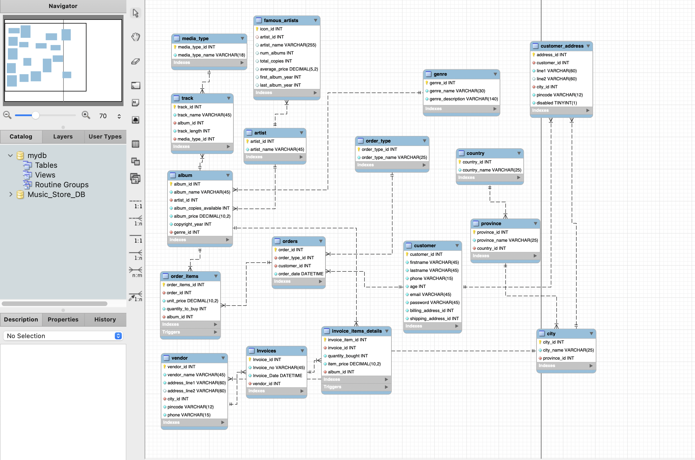

# Data Model Explanation

## Overview
This project is built as a **pure SQL-based data analytics system**, designed to demonstrate both **OLTP (transactional processing)** and **OLAP-style analytics** using only SQL constructs such as joins, views, subqueries, CTEs, window functions, triggers, and stored logic—without relying on external BI tools or programming languages.

The underlying schema follows a **normalized relational (3NF) design**, ensuring data integrity and realistic transactional behavior, while analytical insights are derived using advanced SQL queries layered on top of the OLTP model.

---

## ER Diagram Summary
The ER diagram represents a **cross-border music retail system** operating across multiple geographies. It models the full lifecycle of music retail operations, including catalog management, customer transactions, vendor procurement, and inventory tracking.

The schema is intentionally designed to:
- Avoid redundancy
- Enforce referential integrity
- Support scalable analytical queries

---

## Data Model (ER Diagram)

---

## Core Domains in the Data Model

### 1. Music Catalog Domain
**Purpose:** Manage artists, albums, and tracks.

**Key Tables:**
- `artist`
- `album`
- `track`
- `genre`
- `media_type`

**Design Highlights:**
- One artist can release multiple albums
- Each album contains multiple tracks
- Albums are categorized by genre
- Tracks are associated with media types

This structure enables analysis such as:
- Sales by artist, album, or genre
- Track-level performance insights
- Price and catalog diversity analysis

---

### 2. Customer & Geography Domain
**Purpose:** Model customer identities and geographic distribution.

**Key Tables:**
- `customer`
- `customer_address`
- `city`
- `province`
- `country`

**Design Highlights:**
- Customers are separated from addresses to allow flexibility
- Support for billing and shipping addresses
- Hierarchical geography model (City → Province → Country)
- Address-level enable/disable tracking for realistic customer history

This enables analytics such as:
- Customer distribution by region
- Revenue by geography
- Address-based customer behavior analysis

---

### 3. Sales Transaction Domain (OLTP)
**Purpose:** Capture customer purchases and order activity.

**Key Tables:**
- `orders`
- `order_items`
- `order_type`

**Design Highlights:**
- Orders represent transactional events
- Order items resolve the many-to-many relationship between orders and albums
- Order types distinguish purchase channels (e.g., online vs in-store)

This domain forms the **primary sales fact base** for analytics such as:
- Revenue trends over time
- Top-selling and least-selling albums
- Customer spending behavior

---

### 4. Procurement & Inventory Domain
**Purpose:** Track vendor purchases and inventory flow.

**Key Tables:**
- `vendor`
- `invoices`
- `invoice_items_details`

**Design Highlights:**
- Procurement is modeled independently from sales
- Invoices represent purchases from vendors
- Invoice items capture album quantities and prices
- Inventory levels are maintained using database triggers

This design enables:
- Cost vs revenue analysis
- Profit and margin calculations
- Inventory movement tracking

---

### 5. Business Logic Layer (Inside the Database)
**Purpose:** Enforce real-world business behavior at the database level.

**Implemented Using:**
- Triggers (e.g., stock updates on sales and procurement)
- Constraints and foreign keys
- Derived analytical views

This ensures:
- Data consistency
- Automatic inventory management
- Reliable analytical outcomes

---

## OLTP vs OLAP Usage

### OLTP Characteristics
- Highly normalized tables
- Insert-heavy transactional data
- Referential integrity enforced via keys and constraints
- Real-time inventory updates using triggers

### OLAP via SQL (No Star Schema)
Instead of materialized fact and dimension tables, the project performs analytics using:
- Multi-table joins
- SQL views
- Aggregations
- Subqueries
- CTEs
- Window functions

This approach demonstrates how **advanced analytics can be achieved directly on an OLTP schema** using SQL alone.

---

## Analytical Capabilities Enabled
The data model supports SQL-based analytics such as:
- Customer lifetime value analysis
- Geographic revenue distribution
- Top and bottom product performance
- Time-based sales trends
- Profit and loss evaluation
- Vendor cost and procurement analysis

---

## Design Philosophy
- **Accuracy over shortcuts:** Realistic retail behavior modeled
- **SQL-first analytics:** No dependency on external tools
- **Scalability:** Schema can later support BI tools if required
- **Clarity:** Clear separation of concerns across domains

---

## Conclusion
This data model provides a strong foundation for demonstrating **end-to-end SQL expertise**, covering schema design, transactional integrity, and advanced analytical querying. It reflects real-world retail database design while showcasing the power of SQL for data analytics without additional tooling.
